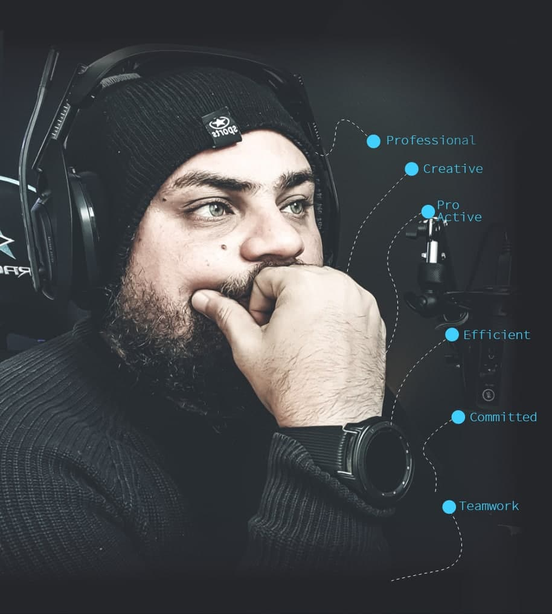

 

 

  
  
  
<h1>Talk is cheap.  Show me the code</h1> 
 
I design and code beautifully simple thing.
and Ilove what I do.
 
 
 
<h5>LET'S CHAT!</h5> 
 
 

  

 
<h1 align="right" >Hello!  I'm Osmany Cruz </h1> 

<h4 align='center'>Even every great project begin 
with an better story</h4>
 

Certified professional with more than 6 years of experience 
in the development and management systems, with great 
capacity for adaptation to the challenges of companies,
where I've collaborated.
With a extensive team management experience, which has
allowed the achievement of objectives under pressure.
As a consequence of specialized education, I can add 
efficient and effective point of view to continue my
professional development in a company that match with 
my ethical values and expectations.
 

 

